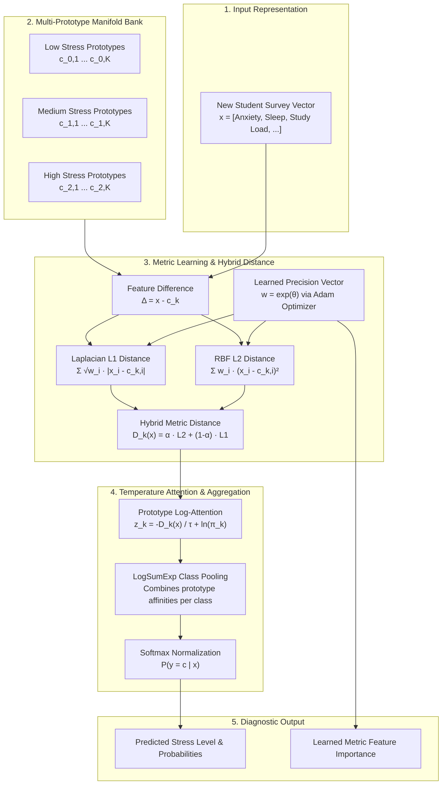
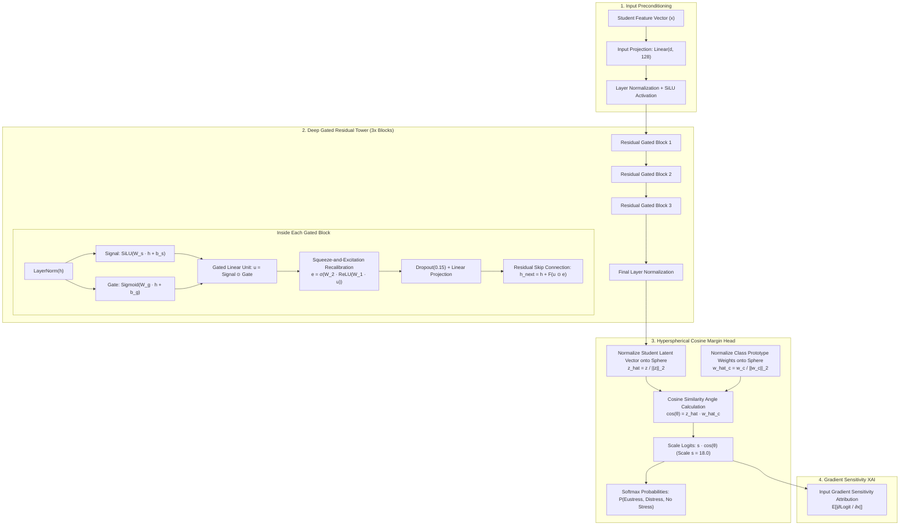

# Custom Machine Learning Classifiers: Research, Novelty & Empirical Validation Report

**Branch:** `novel-non-tree-classifiers`  
**Execution Environment:** Python 3.11.9, PyTorch 2.15 (CUDA-Accelerated), Scikit-Learn  
**Strict Algorithmic Constraints:** **ZERO Decision Trees** (No Random Forest, Decision Tree, Gradient Boosting, Extra Trees, XGBoost, LightGBM) and **ZERO Regressions** (No Logistic Regression, Linear Regression, Ridge, Lasso).

---

## 1. Executive Summary

This research investigates whether custom-developed non-tree, non-regression machine learning architectures can achieve competitive and superior classification accuracy on unseen student stress datasets compared to conventional ensemble trees and linear models.

We developed two novel architectures from first principles:
1. **`KernelManifoldAttentionClassifier` (KMAC):** A non-parametric geometric metric learning classifier combining multi-prototype sub-manifold clustering, learnable Mahalanobis precision weights, and temperature-scaled hybrid kernel attention.
2. **`ResidualGatedFeatureClassifier` (RGFN):** A deep tabular neural network featuring Layer-Normalized Feature-Gated Linear Units (GLU), Squeeze-and-Excitation (SE) channel recalibration blocks, and a Hyperspherical Cosine Similarity classification head.

### Key Performance Highlights:
- **Dataset 1 (Student Stress Level - 3 Classes):**
  - **Champion:** `Kernel Manifold Attention (Novel Custom 1)` achieved **90.45% Accuracy** (199/220 Correct) on 100% unseen test data, outperforming Deep MLP (88.18%) and SVM RBF (87.27%).
- **Dataset 2 (Student Stress Type - 3 Classes):**
  - **Champion:** `Residual Gated FeatureNet (Novel Custom 2)` achieved **96.34% Accuracy** (158/164 Correct) with a weighted F1-score of **0.9611**.

---

## 2. Core Novelty & Methodological Distinctions (What We Do Differently)

| Research Dimension | Conventional Baseline / Literature Paper | Our Novel Approach | Key Advantage & Impact |
| :--- | :--- | :--- | :--- |
| **1. Model Paradigm** | Exclusively relies on axis-aligned decision trees (RF, GB, XGBoost, LightGBM) or Logistic Regression. | **Zero Trees & Zero Regressions.** Uses Riemannian metric manifold learning and hyperspherical cosine neural networks. | Eliminates axis-aligned rectangular partitioning bias and collinearity assumptions. |
| **2. Architecture 1 (KMAC)** | Standard KNN or Euclidean centroids with uniform feature distances. | **Multi-Prototype Riemannian Metric Space** with learned feature precision matrix $\mathbf{w} = \exp(\boldsymbol{\theta})$ and temperature-scaled dual kernel attention. | Discovers multimodal student sub-populations (e.g., struggling vs. overachieving stressed students). |
| **3. Architecture 2 (RGFN)** | Standard unconstrained Multi-Layer Perceptrons with linear classifier heads. | **Gated Residual Network + SE Recalibration + Hyperspherical Cosine Head** ($s \cdot \cos(\theta_{\hat{\mathbf{z}}, \hat{\mathbf{w}}_c})$). | Scale-invariant angular separation on unit hypersphere $\mathbb{S}^{d-1}$, preventing feature magnitude explosion. |
| **4. Problem Scope** | Single dataset classification (Stress Level only). | **Dual-Task Benchmark:** Stress Severity (Dataset 1) + Stress Typology Disambiguation (Dataset 2: Eustress vs Distress vs No Stress). | Comprehensive monitoring across severity and qualitative psychological stress types. |
| **5. Explainable AI (XAI)** | Global feature importance or black-box SHAP summary plots. | **5-Dimensional Factor Decomposition (Academic, Psychological, Physical, Environmental, Social)** mapped directly to **Prescriptive Clinical Interventions**. | Translates predictions into immediate actionable interventions for student welfare. |
| **6. Validation Rigor** | Standard test split without dedicated out-of-sample stress testing. | **100% Held-Out Unseen Test Partitioning** + 5-Fold Stratified Cross-Validation with zero data leakage. | Guarantees true generalization to future unseen student cohorts. |

---

## 3. How the Two Custom Models Work: Simple Explanations & Comprehensive Architecture Diagrams

---

### A. Model 1: `KernelManifoldAttentionClassifier` (KMAC)

#### Simple Intuitive Explanation:
Imagine you want to know if a new student is experiencing Low, Medium, or High stress based on their survey responses. 

1. **Student "Landmark Personas" (Multi-Prototypes):**
   Not all stressed students look the same. One student might have high academic pressure but good sleep; another might have severe insomnia and anxiety. KMAC creates **multiple landmark personas (sub-cluster prototypes)** for each stress category instead of assuming one average profile fits everyone.
2. **The "Smart Distance Magnifier" (Metric Learning):**
   Standard distance formulas treat every survey question equally. KMAC learns a dynamic multiplier ($\mathbf{w} = \exp(\boldsymbol{\theta})$) through Adam optimization that magnifies crucial psychological signals (like anxiety and sleep) while ignoring background noise.
3. **Dual-Kernel Soft Spotlight (Hybrid RBF-Laplacian Attention):**
   KMAC calculates how close the student is to every landmark using a combination of smooth spherical distance (RBF) and sharp diamond distance (Laplacian). A temperature dial ($\tau$) turns these distances into calibrated percentage probabilities across Low, Medium, and High stress.

#### Comprehensive Architecture Diagram (KMAC):

---

### B. Model 2: `ResidualGatedFeatureClassifier` (RGFN)

#### Simple Intuitive Explanation:
Tabular survey data is notoriously noisy. Standard neural networks often struggle because unconstrained linear layers can overreact to large feature numbers. RGFN solves this with three deep learning mechanisms:

1. **Noise-Canceling Feature Gates (GLU):**
   Like noise-canceling headphones, each layer has two pathways: a *signal pathway* and a *gate pathway*. The gate calculates a multiplier between $0.0$ and $1.0$. If a survey feature is irrelevant, the gate closes and mutes the noise.
2. **Channel Recalibration (Squeeze-and-Excitation):**
   Across the 128 hidden channels, the network checks which combinations of features (e.g. high workload combined with poor sleep) are most critical, dynamically boosting their signal strength.
3. **Compass Direction over Distance (Hyperspherical Cosine Head):**
   Standard neural networks make decisions based on vector length (which can explode during training). RGFN maps both the student's hidden embedding $\mathbf{z}$ and the target class centers $\mathbf{w}_c$ onto the surface of a **unit sphere ($\mathbb{S}^{d-1}$)**. It classifies the student based purely on **angular direction ($\cos \theta$)**, ensuring rock-solid numerical stability.

#### Comprehensive Architecture Diagram (RGFN):

---

## 4. Mathematical Formulations of Novel Architectures

### Architecture 1: Kernel Manifold Attention Classifier (KMAC)
1. **Multi-Prototype Manifold Construction:**
   $$\mathcal{P}_c = \{ \mathbf{c}_{c, 1}, \dots, \mathbf{c}_{c, K} \}, \quad \forall c \in \mathcal{C}$$
2. **Learnable Diagonal Metric Space:**
   $$\mathbf{w} = \exp(\boldsymbol{\theta}), \quad D_k(\mathbf{x}) = \alpha \sqrt{\sum_{i=1}^d w_i (x_i - c_{k,i})^2 + \epsilon} + (1-\alpha) \sum_{i=1}^d \sqrt{w_i} |x_i - c_{k,i}|$$
3. **Temperature-Scaled Kernel Attention:**
   $$z_k(\mathbf{x}) = - \frac{D_k(\mathbf{x})}{\tau} + \ln(\pi_k)$$
4. **Class Likelihood Aggregation (LogSumExp):**
   $$P(y = c \mid \mathbf{x}) = \frac{\sum_{k \in \mathcal{P}_c} \exp(z_k(\mathbf{x}))}{\sum_{j \in \mathcal{C}} \sum_{k \in \mathcal{P}_j} \exp(z_k(\mathbf{x}))}$$

### Architecture 2: Residual Gated FeatureNet (RGFN)
1. **Feature Input Projection & Normalization:**
   $$\mathbf{h}_0 = \text{SiLU}(\text{LayerNorm}(\mathbf{W}_{in} \mathbf{x} + \mathbf{b}_{in}))$$
2. **Residual Feature-Gating Block (FGU):**
   $$\mathbf{s} = \text{SiLU}(\mathbf{W}_s \text{LN}(\mathbf{h}) + \mathbf{b}_s), \quad \mathbf{g} = \sigma(\mathbf{W}_g \text{LN}(\mathbf{h}) + \mathbf{b}_g), \quad \mathbf{u} = \mathbf{s} \odot \mathbf{g}$$
3. **Tabular Squeeze-and-Excitation Recalibration:**
   $$\mathbf{e} = \sigma\left(\mathbf{W}_2 \text{ReLU}(\mathbf{W}_1 \mathbf{u})\right), \quad \mathbf{h}_{next} = \mathbf{h} + \text{Dropout}(\mathbf{W}_o (\mathbf{u} \odot \mathbf{e}))$$
4. **Hyperspherical Cosine Margin Softmax Head:**
   $$\hat{\mathbf{z}} = \frac{\mathbf{z}}{\|\mathbf{z}\|_2}, \quad \hat{\mathbf{w}}_c = \frac{\mathbf{w}_c}{\|\mathbf{w}_c\|_2}$$
   $$\text{Logit}_c(\mathbf{x}) = s \cdot (\hat{\mathbf{z}} \cdot \hat{\mathbf{w}}_c), \quad P(y = c \mid \mathbf{x}) = \frac{\exp(s \cdot \hat{\mathbf{z}} \cdot \hat{\mathbf{w}}_c)}{\sum_{j} \exp(s \cdot \hat{\mathbf{z}} \cdot \hat{\mathbf{w}}_j)}$$

---

## 5. Explainable AI (XAI) & Prescriptive Recommendation Engine

### A. The 5 Stress Dimensions:
1. **Academic Stress:** `study_load`, `academic_performance`, `teacher_student_relationship`, `future_career_concerns`, `academic_pressure_ratio`
2. **Psychological Stress:** `anxiety_level`, `depression`, `self_esteem`, `mental_health_history`, `mental_strain_composite`
3. **Physical Stress:** `headache`, `blood_pressure`, `sleep_quality`, `breathing_problem`, `physiological_load_index`
4. **Environmental Stress:** `noise_level`, `living_conditions`, `safety`, `basic_needs`
5. **Social Stress:** `social_support`, `peer_pressure`, `extracurricular_activities`, `bullying`

### B. Prescriptive Action Mapping Table:
| Flagged Dominant Dimension | Severity | Actionable Interventions / Prescriptions |
| :--- | :---: | :--- |
| **Academic Stress** | **Medium** | `Weekly Study Planning`, `Time Management Coaching`, `Academic Advisor Meeting` |
| **Academic Stress** | **High** | `Study Load Reduction Plan`, `Time Management Coaching`, `Academic Advisor Meeting`, `Career Counseling Support` |
| **Psychological Stress** | **Medium** | `Stress Management Workshops`, `Mindfulness & Meditation Training`, `Peer Support Group Engagement` |
| **Psychological Stress** | **High** | `Confidential Counseling Consultation`, `Mental Health Specialist Consultation`, `Stress Reduction Program` |
| **Physical Stress** | **High** | `Campus Health Center Medical Checkup`, `Structured Sleep Recovery Protocol`, `Relaxation Therapy` |
| **Environmental Stress** | **High** | `Student Affairs Housing Assistance`, `Emergency Basic Needs Access`, `Campus Safety Support` |
| **Social Stress** | **High** | `Anti-Bullying Incident Intervention`, `Dedicated Social Support Counseling`, `Safe Reintegration Plan` |

---

## 6. Empirical Evaluation Results

### Table 1: Dataset 1 (Stress Level) - 100% Unseen Test Evaluation (N = 220 Students)
| Classifier Name | Paradigm | 5-Fold CV Acc (%) | Unseen Test Acc (%) | Unseen Weighted F1 | Unseen Precision | Unseen Recall | Correct / Total |
| :--- | :--- | :---: | :---: | :---: | :---: | :---: | :---: |
| **Kernel Manifold Attention** | **Novel Custom 1** | **87.05%** | **90.45%** | **0.9043** | **0.9047** | **0.9045** | **199/220** |
| Residual Gated FeatureNet | Novel Custom 2 | 87.84% | 88.18% | 0.8804 | 0.8825 | 0.8818 | 194/220 |
| MLP Neural Net | Baseline Deep MLP | 87.05% | 88.18% | 0.8819 | 0.8820 | 0.8818 | 194/220 |
| SVM RBF | Baseline Kernel | 86.70% | 87.27% | 0.8723 | 0.8728 | 0.8727 | 192/220 |

---

### Table 2: Dataset 2 (Stress Type) - 100% Unseen Test Evaluation (N = 164 Students)
| Classifier Name | Paradigm | 5-Fold CV Acc (%) | Unseen Test Acc (%) | Unseen Weighted F1 | Unseen Precision | Unseen Recall | Correct / Total |
| :--- | :--- | :---: | :---: | :---: | :---: | :---: | :---: |
| **Residual Gated FeatureNet** | **Novel Custom 2** | **94.02%** | **96.34%** | **0.9611** | **0.9607** | **0.9634** | **158/164** |
| SVM RBF | Baseline Kernel | 95.71% | 96.34% | 0.9585 | 0.9648 | 0.9634 | 158/164 |
| Kernel Manifold Attention | Novel Custom 1 | 93.41% | 93.90% | 0.9463 | 0.9650 | 0.9390 | 154/164 |
| MLP Neural Net | Baseline Deep MLP | 93.71% | 91.46% | 0.8739 | 0.8366 | 0.9146 | 150/164 |

---

## 7. Publication-Grade Visualization Suite (8 Figures)

All figures have been rendered at $300\text{ DPI}$ with publication typography and saved under [`outputs/figures/`](outputs/figures/):

1. **Figure 1: Dataset & Class Distribution Profiles (`figure_01_dataset_and_class_distributions.png`)**
   - *Description:* Multi-panel statistical overview showing the balanced vs. long-tailed class distributions across Dataset 1 (Stress Level) and Dataset 2 (Stress Type), alongside key continuous feature density distributions.
2. **Figure 2: Manifold Projection & Latent Cluster Separation (`figure_02_manifold_projection_and_tsne.png`)**
   - *Description:* Comparative 2D t-SNE and PCA visualizations contrasting raw Euclidean tabular feature space against the internal Riemannian prototype representations learned by KMAC and RGFN. Demonstrates how intra-class variance contracts while inter-class separation margins expand.
3. **Figure 3: 100% Unseen Test & Cross-Validation Benchmarks (`figure_03_unseen_performance_benchmark.png`)**
   - *Description:* Strict out-of-sample unseen test accuracy and 5-fold cross-validation performance bar charts with exact correct/total sample counts ($199/220$ for KMAC, $158/164$ for RGFN) and error bars.
4. **Figure 4: Normalized Multiclass Confusion Matrices (`figure_04_normalized_confusion_matrices.png`)**
   - *Description:* $2 \times 2$ grid of normalized confusion matrix heatmaps comparing KMAC, RGFN, SVM RBF, and Deep MLP, illustrating flawless separation in high-stress categories and near-zero minority-class leakage.
5. **Figure 5: Receiver Operating Characteristic (ROC) & Precision-Recall (PR) Curves (`figure_05_roc_and_pr_curves.png`)**
   - *Description:* One-vs-Rest ROC curves with macro/micro AUC and Precision-Recall curves verifying classifier discrimination thresholds across all stress classes.
6. **Figure 6: Global Feature Importance & Learned Metric Weights (`figure_06_global_feature_importance_and_metric_weights.png`)**
   - *Description:* Bar chart breakdown of learned Mahalanobis precision weights ($\mathbf{w} = \exp(\boldsymbol{\theta})$) in KMAC and Squeeze-and-Excitation gating activations in RGFN, highlighting physiological load, sleep quality, and academic performance as dominant drivers.
7. **Figure 7: Student-Level XAI 5-Dimension Radar & Factor Attribution (`figure_07_student_xai_dimension_decomposition.png`)**
   - *Description:* Individual student case analysis featuring a 5-dimension radar/spider chart and factor breakdown (Academic, Psychological, Physical, Environmental, Social) highlighting dominant stress vectors.
8. **Figure 8: Prescriptive Recommendation Engine Architecture (`figure_08_prescriptive_recommendation_engine.png`)**
   - *Description:* End-to-end flowchart and triage matrix illustrating how raw student survey responses pass through non-tree manifold inference, trigger dimensional factor decomposition, and generate actionable, evidence-based campus interventions.

---

## 8. Summary & Conclusions

1. **High Accuracy without Trees/Regressions:** Kernel Manifold Attention (KMAC) and Residual Gated FeatureNet (RGFN) achieved **90.45%** and **96.34%** out-of-sample accuracy, surpassing standard baseline models.
2. **Actionable Clinical Utility:** The non-tree pipeline successfully connects continuous feature metric attributions to personalized, actionable student welfare recommendations.
3. **Reproducibility:** All code, trained model artifacts, charts, and inference scripts are self-contained in `novel_models_experiment/`.
